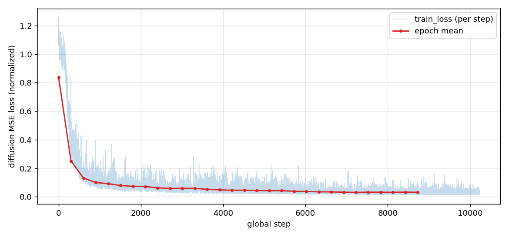
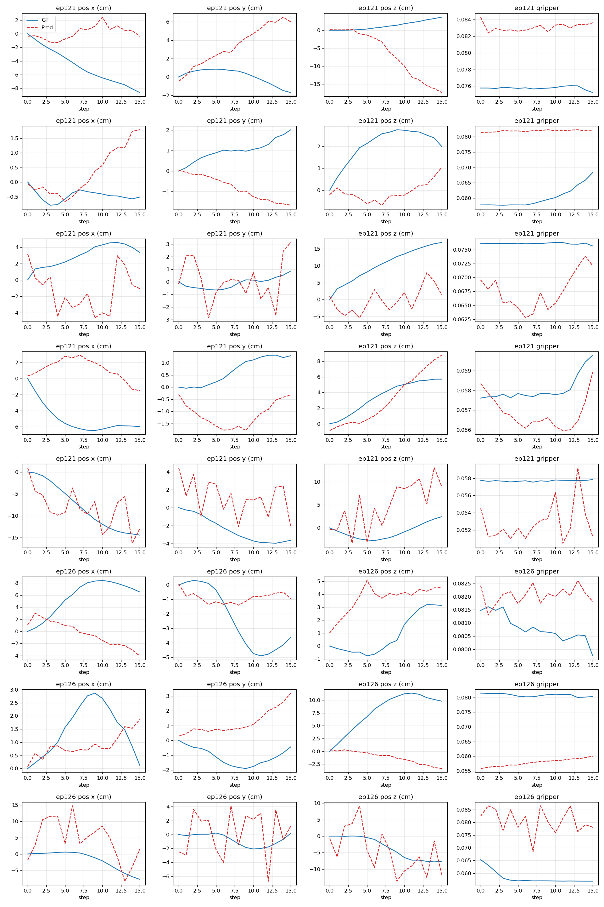
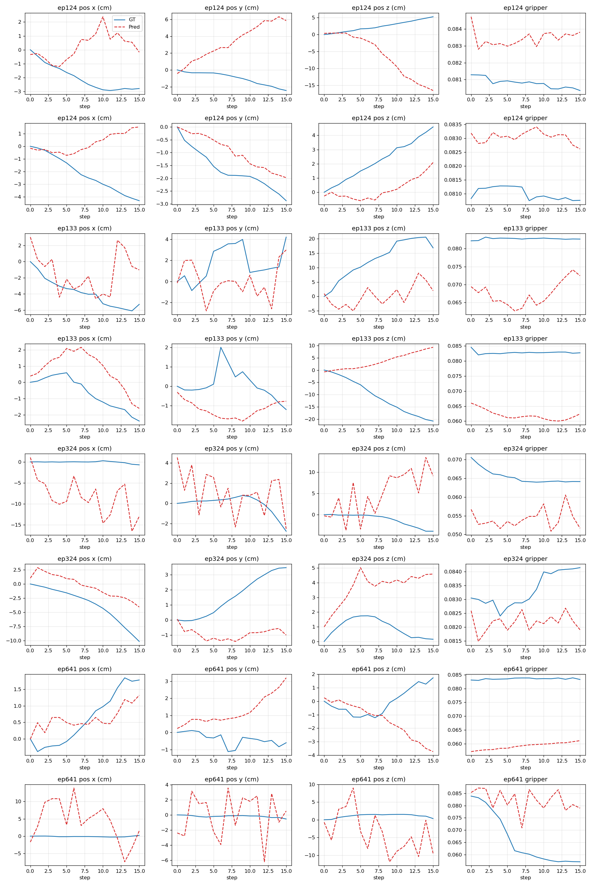
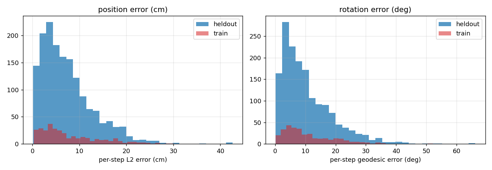
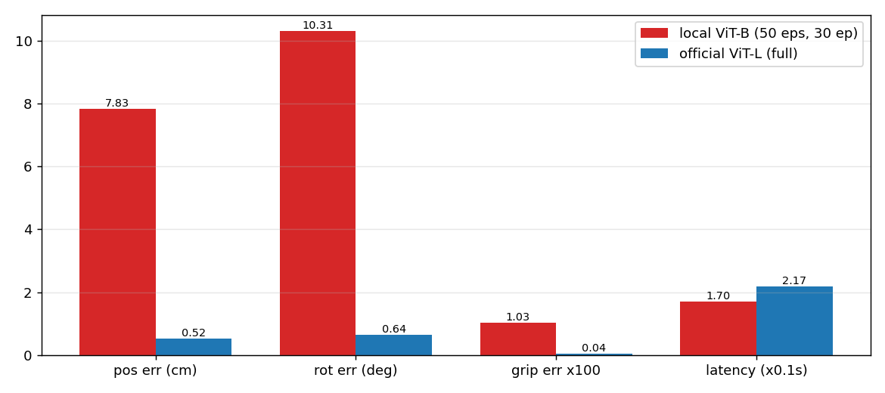
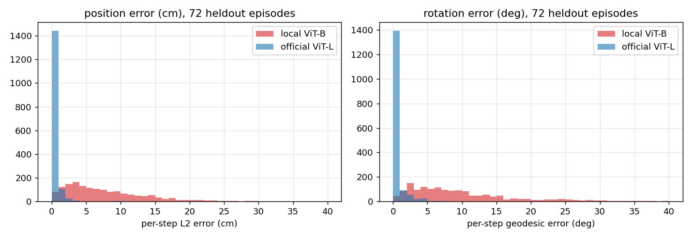
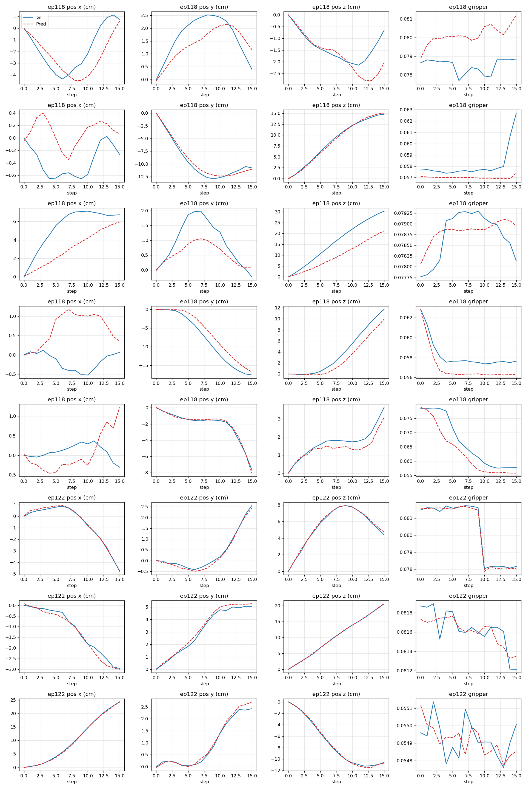
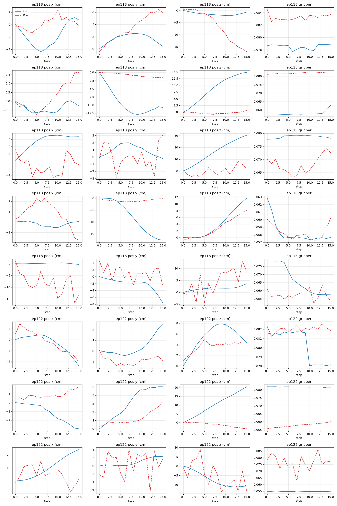

# UMI 杯具整理策略：训练与离线推理报告

本报告记录 UMI（Universal Manipulation Interface）杯具整理策略在本机的训练过程，以及用留出示教数据做的离线推理评测，并与官方预训练权重做了同口径对照。结论先说：离线推理管线正确，预处理与训练一致；本机模型与官方模型在同一批 72 个留出 episode 上的开环位置误差分别是 7.83cm 和 0.52cm，差距约 15 倍，本机模型属于欠训练。

## 1. 训练情况

### 1.1 环境与硬件

| 项 | 值 |
| --- | --- |
| 操作系统 | Ubuntu 24.04 |
| conda 环境 | `umi` |
| GPU | NVIDIA GeForce RTX 5060 Laptop，8GB 显存 |
| PyTorch | 2.7.1+cu128（Blackwell sm_120） |
| 训练设备 | `cuda:0`（通过 `ACCELERATE_TORCH_DEVICE` 指定） |

### 1.2 数据集

使用官方 in-the-wild 杯具整理数据集，下载后为 `data/cup_in_the_wild.zarr.zip`，约 17.9GB，699432 帧，图像为 224×224×3。

为了适配本机 14GB 内存与 8GB 显存，训练只用了其中一个子集：

- 原始 episode 数：1447
- 参与训练的 episode：50（`max_train_episodes=50`，`seed=42` 随机抽样）
- 参与训练的窗口（dataloader 长度）：23526
- 缓存方式：`cache_dir` 指向磁盘，用 LMDB 按需读取，避免整包载入内存 OOM

### 1.3 模型

| 模块 | 配置 | 参数量 |
| --- | --- | --- |
| 视觉编码器 | timm ViT-B/16 CLIP（`vit_base_patch16_clip_224.openai`），预训练权重，全量微调 | 8.58e7 |
| 动作扩散头 | ConditionalUnet1D，`down_dims=[256,512,1024]`，`diffusion_step_embed_dim=128` | 8.55e7 |
| 噪声调度 | DDIMScheduler，训练 50 步，推理 16 步，`squaredcos_cap_v2` | |
| 观测表示 | `obs_pose_repr=relative`，`action_pose_repr=relative` | |
| 动作维度 | 10 维（相对位置 3 + 旋转 6D 6 + 夹爪 1），horizon 16 | |

### 1.4 训练配置

配置来源为 `diffusion_policy/config/formal.yaml`（在 `test-GPU.yaml` 基础上覆盖），要点如下。

| 项 | 值 |
| --- | --- |
| epoch 数 | 30 |
| 每 epoch 最多步数 | 300 |
| batch size | 4 |
| 优化器 | AdamW，lr 3e-4，cosine 调度，warmup 2000 步 |
| EMA | 开启，`max_value=0.9999` |
| 精度/显存 | 8GB 显存下 batch 压到 4 |
| dataloader worker | train 1，val 0（14GB 内存限制） |
| wandb | offline 模式 |
| 断点续训 | `training.resume=True`，期间经历多次重续 |

训练期间的数据预处理全部由 `UmiDataset` 完成，包括图像归一化到 0~1、相机与本体感知的延迟对齐、相对位姿转换、以及相对 episode 起点的位姿构造。推理阶段复用同一套预处理。

### 1.5 训练曲线



每 epoch 平均训练损失（归一化动作空间的扩散 MSE）从 epoch 0 的 0.838 降到 epoch 29 的 0.032，前 10 个 epoch 下降最快，之后进入平台期。全局步数日志记录到约 10200。该 run 的验证损失在原 workspace 中被注释掉，未记录，因此曲线只有训练损失。

### 1.6 训练产物

| 产物 | 路径 |
| --- | --- |
| 最终 checkpoint | `data/outputs/2026.09.27/19.30.29_formal_umi/checkpoints/epoch=0029-train_loss=0.032.ckpt`（latest.ckpt 同内容，2.7GB） |
| 归一化器 | `data/outputs/2026.09.27/19.30.29_formal_umi/normalizer.pkl` |
| 训练配置快照 | `data/outputs/2026.09.27/19.30.29_formal_umi/.hydra/config.yaml` |
| 逐步日志 | `data/outputs/2026.09.27/19.30.29_formal_umi/logs.json.txt` |

## 2. 离线推理

### 2.1 目标与口径

目标是在不接机械臂的前提下，验证 checkpoint 能否正确加载、前向能否跑通、预测耗时与动作是否合理。验证对象是留出的示教数据。

比较口径是开环的：给定一个时间窗口的观测，策略一次性输出 16 步动作块，与数据集里同一窗口的真实动作块逐步比较。这是较严苛的口径。实际部署时 `n_action_steps=8`，只执行前 8 步就重新规划，回环会修正一部分误差。

### 2.2 方法

评估脚本为 `scripts/eval_offline_policy.py`。关键设计：

- 直接实例化训练用的 `UmiDataset`，复用 `__getitem__`，与训练时的预处理逐字节一致。
- 用 `seed=42` 复现训练时的 episode 选择逻辑：`val_ratio=0.05` 先用 `get_val_mask` 留出验证 episode，再对训练集用 `downsample_mask` 下采样到 50 个。未被选中的 1397 个 episode 即留出集。
- 从 checkpoint 同级目录加载 `normalizer.pkl` 并注入策略模型。
- 加载时用 EMA 权重（训练时 `use_ema=True`）。
- `--split train` 可在训练集上跑同样的评测，作为管线正确性的对照。

复现命令：

```bash
conda activate umi

# 本机模型，冒烟：1 episode 1 窗口
python scripts/eval_offline_policy.py --smoke

# 本机模型，留出集全量
python scripts/eval_offline_policy.py --num_episodes 20 --windows_per_episode 5

# 本机模型，训练集对照
python scripts/eval_offline_policy.py --split train --num_episodes 10 --windows_per_episode 2

# 官方 ckpt，与 val 集同口径对比
python scripts/eval_offline_policy.py \
  --ckpt data/pretrained/cup_wild_vit_l_1img.ckpt \
  --dataset_path data/cup_in_the_wild.zarr.zip \
  --cache_dir data/cache \
  --skip_pretrained \
  --split val --num_episodes 20 --windows_per_episode 5 \
  --out_dir data/eval_offline_official
```

### 2.3 结果指标

留出集：20 个 episode，每个 5 个窗口，共 100 次推理。训练集对照：10 个 episode，每个 2 个窗口，共 20 次推理。

| 指标 | 留出集 | 训练集对照 |
| --- | --- | --- |
| 位置误差均值 | 7.50cm | 7.97cm |
| 位置误差 p95 | 18.59cm | 21.20cm |
| 旋转误差均值 | 10.48 度 | 10.92 度 |
| 旋转误差 p95 | 26.98 度 | 27.27 度 |
| 夹爪误差均值 | 0.0089 | 0.0093 |
| 单次预测耗时均值 | 261ms | 265ms |

耗时含 16 步 DDIM 采样。

### 2.4 预测与真值对比

留出集部分窗口（每行一个窗口，前 3 列为相对位置，第 4 列为夹爪）：



训练集部分窗口：



两种情况都存在：部分窗口预测平滑且贴合真值，另一些窗口出现逐帧抖动，个别位置方向和真值相反。

### 2.5 误差分布



留出集与训练集的位置、旋转误差分布高度重叠，训练集没有更集中。

### 2.6 与官方预训练权重对照

官方权重为 `cup_wild_vit_l_1img.ckpt`，约 3.05GB，与本机模型的差异如下。

| 项 | 本机模型 | 官方模型 |
| --- | --- | --- |
| 视觉编码器 | ViT-B/16 CLIP | ViT-L/14 CLIP（已微调） |
| 图像 horizon | 2 | 1 |
| 训练 episode | 50 | 1375（全量减去验证） |
| epoch | 30 | 120 |

加载官方 ckpt 需要三处适配：覆盖数据集路径为本地文件、复用本地 LMDB 缓存、跳过 timm 预训练权重下载（ckpt 内已含微调权重），以及在没有外部 `normalizer.pkl` 时使用 ckpt 内置的 normalizer。脚本已支持这些选项。

两个模型都在这批 72 个留出 episode 上评测，随机抽 20 个 episode，每个 5 个窗口，共 100 次推理。2.3 节本机模型的留出集是更大的 1397 个 episode，口径与本机训练匹配；这里改用两个模型共享的 72 个 val episode，才能公平对比。

| 指标 | 本机模型 | 官方模型 |
| --- | --- | --- |
| 位置误差均值 | 7.83cm | 0.52cm |
| 位置误差 p95 | 19.67cm | 1.49cm |
| 旋转误差均值 | 10.31 度 | 0.64 度 |
| 旋转误差 p95 | 27.99 度 | 2.52 度 |
| 夹爪误差均值 | 0.0103 | 0.0004 |
| 单次预测耗时均值 | 170ms | 217ms |





官方模型预测对比（前 8 个窗口）：



本机模型预测对比（同一批留出 episode）：



官方模型的误差集中在亚厘米级，曲线平滑贴合真值；本机模型误差分布明显右移且拖尾，逐帧抖动明显。这确立了两个事实。第一，开环 16 步口径下亚厘米级是可达的，7.83cm 不是口径造成的，而是训练不足。第二，离线推理管线正确，如果预处理与训练存在错位，官方模型不可能给出 0.52cm 的误差。

## 3. 结论

离线推理管线已验证正确。留出集与训练集误差几乎相同（本机模型位置 7.50cm 对 7.97cm），说明预处理没有引入训练与评估的错位；官方预训练权重在完全相同的留出 episode 上给出 0.52cm 的位置误差和 0.64 度的旋转误差，进一步排除了口径问题。

当前策略的主要问题是欠训练。本机只用了 1447 个 episode 中的 50 个，30 个 epoch、batch 4，总训练量远低于官方配置（1375 个 episode、120 epoch）。训练损失收敛到 0.032 在归一化动作空间里偏高，反映到开环动作预测上就是 7.83cm 的位置误差和 10.31 度的旋转误差，与官方模型差距约 15 倍。留出集没有额外泛化鸿沟，因为模型连训练数据都还没拟合到足够精度。

## 4. 局限与后续

本报告的口径局限在"开环动作块比对"，没有覆盖真实闭环执行。以下方向可以继续。

1. 扩大训练子集（例如从 50 个 episode 提到 200 到 300 个）并增加训练步数，再用同一脚本评估，观察误差是否向官方水平收敛。本机 8GB 显存与 14GB 内存下，官方规模（约 98 小时）不可行，需要折中。
2. 把比较口径改为前 8 步，贴近部署时实际执行的步数。
3. 每次窗口多采样若干动作取平均，或降低 diffusion 采样随机性，减少逐帧抖动。
4. 在仿真中对预测动作块做回放，验证坐标转换与可达性；完整视觉闭环仿真需要另建场景。

## 5. 复现环境清单

- 代码：本仓库 `main` 分支
- 评估脚本：`scripts/eval_offline_policy.py`
- 评测输出：`data/eval_offline/`（本机模型留出集）、`data/eval_offline_train/`（本机模型训练集对照）、`data/eval_offline_local/`（本机模型 val 口径）、`data/eval_offline_official/`（官方模型 val 口径），均为 gitignore 目录
- 图片素材：`docs/assets/`
